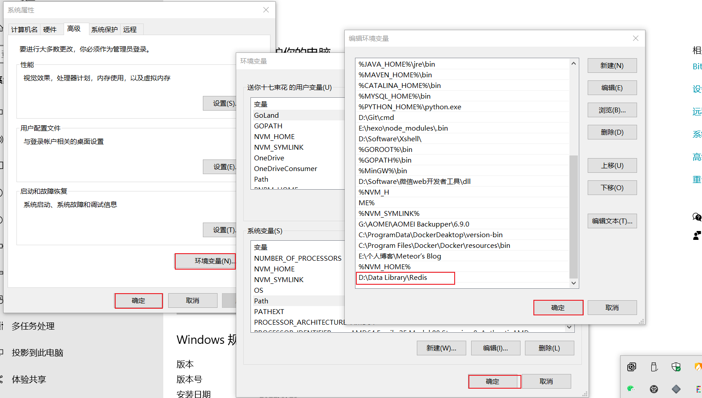

# gin_gorm_oj
基于Gin、Gorm的在线练习系统

## 参考链接
GOLANG下载网址： https://golang.google.cn/dl/

参考文档 Module：https://www.kancloud.cn/aceld/golang/1958311

GORM中文官网：https://gorm.io/zh_CN/docs/

GIN中文官网：https://gin-gonic.com/zh-cn/docs/

## 整合 Swagger
参考文档:[https://github.com/swaggo/gin-swagger](https://github.com/swaggo/gin-swagger)

接口访问地址: http://localhost:8080/swagger/index.html

``` text
// GetProblemList
// @Tags 公共方法
// @Summary 问题列表
// @Param page query int false "page"
// @Param size query int false "size"
// @Success 200 {string} json "{"code":"200","msg","","data":""}"
// @Router /problem-list [get]
```

## 安装 jwt
``` shell
 go get github.com/dgrijalva/jwt-go
```

## 安装email发送包
```shell
github.com/jordan-wright/email
```

## 安装UUID
通过UUID获取唯一标识
``` shell
 go get github.com/satori/go.uuid
```

## 安装redis
[安装redis](https://github.com/tporadowski/redis/releases)
```shell
// 启动redis服务
redis-server.exe redis.windows.conf
```
### 配置环境变量
为了方便，建议把Redis路径配置到系统变量Path值中，这样就省得再输路径了。

